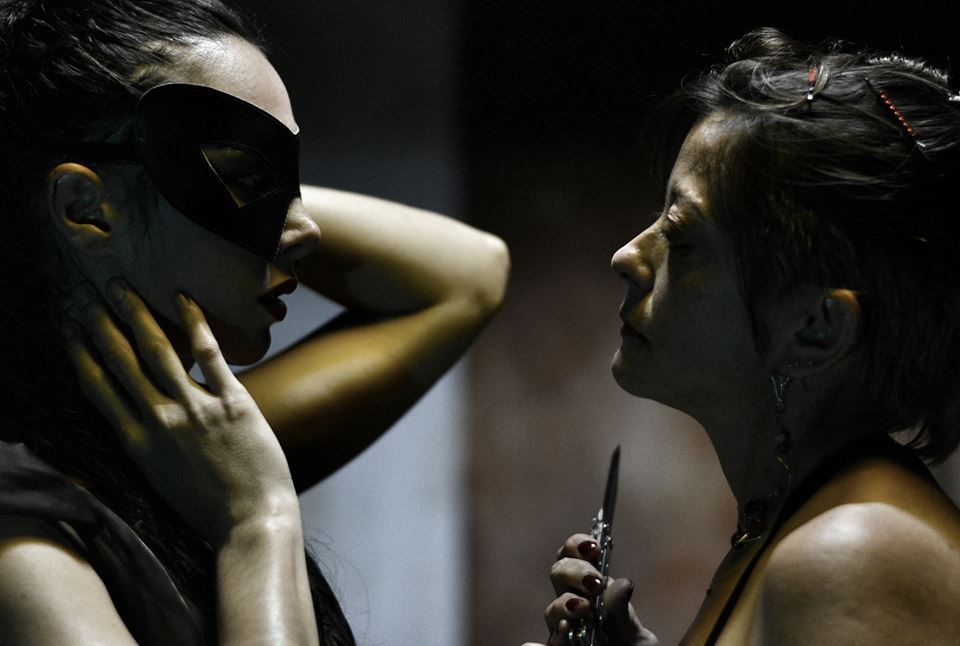
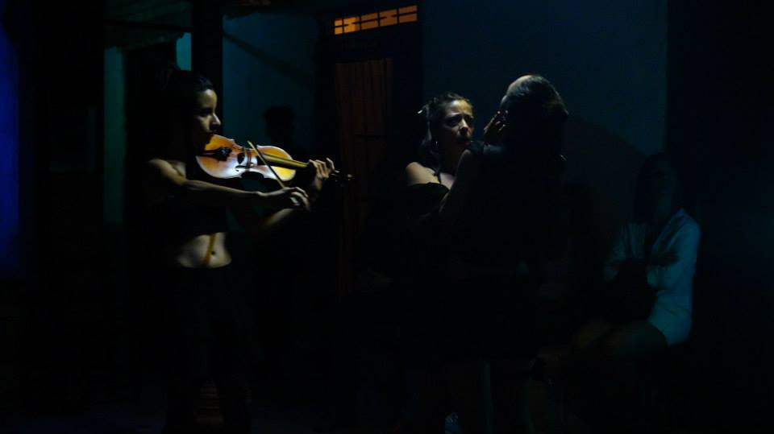

# Actuación

## Sex pic xel (con Acciones Periféricas)

Exploración sobre la libertad sexual de las mujeres.

## La Vitrina. (Teatro Nephila)

Mediante el  postdrama, se aborda la condición de la mujer como valor de uso y valor de cambio, haciendo muy fina la fisura entre actuación y performance, mediante la acción en tiempo real, para hablar de lo que significa ser puta en la cultura occidental.

<iframe width="854" height="510" src="https://www.youtube.com/embed/LKXrQ_RyCB4" frameborder="0" allowfullscreen></iframe>

<iframe width="854" height="510" src="https://www.youtube.com/embed/jLTklxtmiIQ" frameborder="0" allowfullscreen></iframe>

