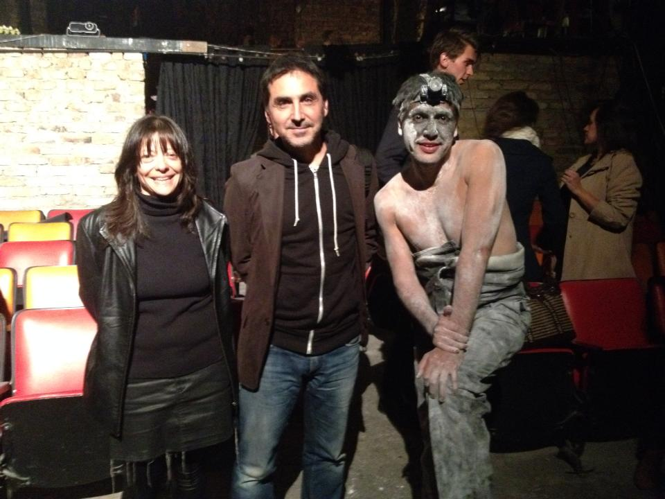
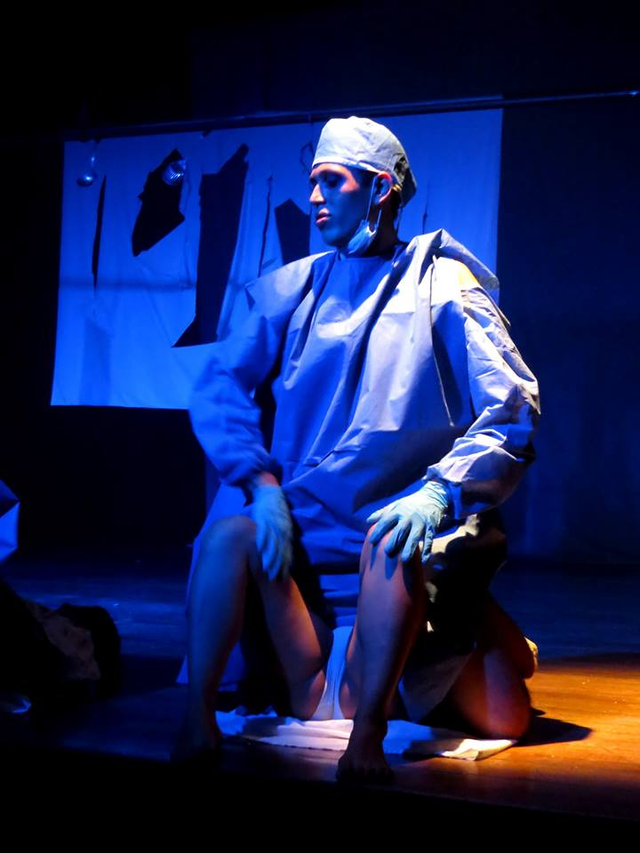
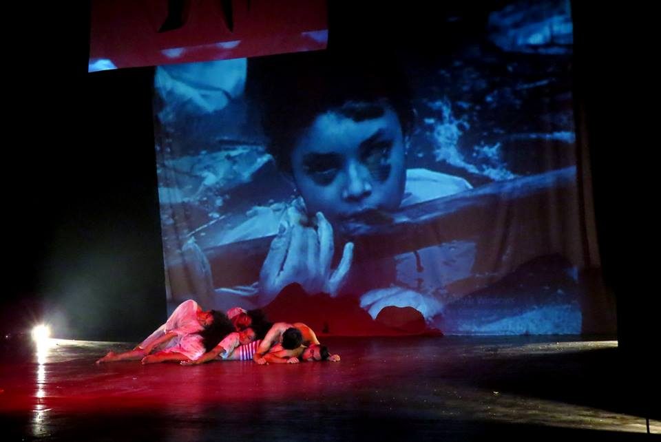
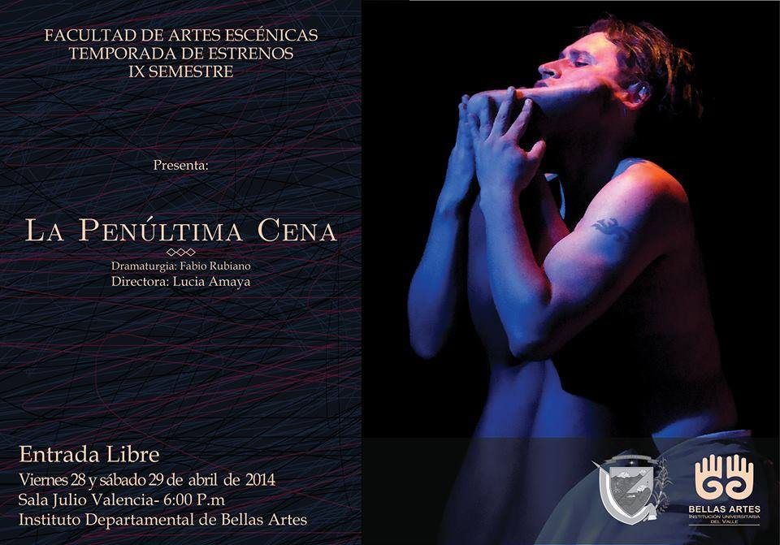
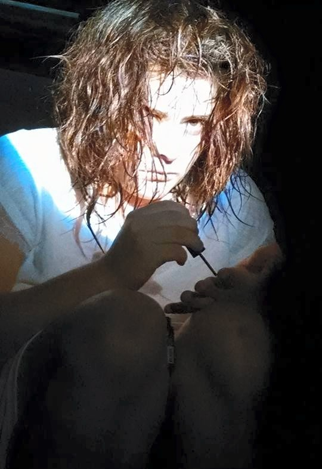

# Dirección

## Fritzl Agonista

Dramaturgia: *Emilio García Wehbi*. Actuación: Francisco Sierra. Asistencia de dirección: Andrés Montes, Música: Edwin Limas y Mike Gonzáles, 2013.
Puesta en escena posdramática que devela la minorización de la mujer como producto de una sociedad enferma amparada en los mandatos judeo-cristianos.

<https://www.facebook.com/fritzlagonista>

<iframe width="854" height="510" src="https://www.youtube.com/embed/9yQbkz6-j8g" frameborder="0" allowfullscreen></iframe>

<iframe width="854" height="510" src="https://www.youtube.com/embed/U-03m2DRGUM" frameborder="0" allowfullscreen></iframe>

<iframe width="854" height="510" src="https://www.youtube.com/embed/QrA8qQ-BXNU" frameborder="0" allowfullscreen></iframe>

<iframe width="854" height="510" src="https://www.youtube.com/embed/nApfkIqoces" frameborder="0" allowfullscreen></iframe>

<iframe width="854" height="510" src="https://www.youtube.com/embed/f2H8trzgfzc" frameborder="0" allowfullscreen></iframe>

<iframe width="854" height="510" src="https://www.youtube.com/embed/eaKMensLOwY" frameborder="0" allowfullscreen></iframe>

<iframe width="854" height="510" src="https://www.youtube.com/embed/3VoHlhOSp-o" frameborder="0" allowfullscreen></iframe>

## Sex pic xel.
En la intimidad de un baño, dos mujeres develan el universo sexual femenino a partir de su propia experiencia. Con la colaboracion De Shari Cellis en la creacion y el performance.

## Sex pic sel

## La penúltima cena

Dramaturgia: *Fabio Rubiano.*
Estudiantes X semestre de Artes escénicas, Bellas Artes, 2014.

Judas Iscariote y María Magdalena, personajes estigmatizados como traidor y puta, se dan cita para mostrarnos sus diversas caras en la sociedad colombiana actual.

## A la diestra de Dios Padre.

Dramaturgia: *Enrique Buenaventura*, Colegio Alas 2014.
Desde el folclor colombiano un grupo de personajes marginales nos muestran una dimensión política y ética de la desigualdad social en Colombia.

## Sueño de una noche de verano

Dramaturgia: *William Shakespeare* Colegio Alas 2015.
Se dan citas diversas formas de encontrar y luchar por el amor, en la que convergen aristócratas, humildes, hadas y duendes, en un ambiente real y fantástico a la vez.

## 4:48 Psicosis

Dramaturgia *Sarah Kane.* El nombre de esta obra hace referencia a la hora en la que se tiende a acabar los efectos de los farmacos tomados la noche anterior. Muestra que es lo que pasa por la mente de una persona cuando no distingue lo real de lo imaginario, los recuerdos de lo fantasioso, los sueños de las pesadillas.

<iframe width="854" height="510" src="https://www.youtube.com/embed/XK7Dy4GyZu0" frameborder="0" allowfullscreen></iframe>
