# Performance.

## Acciones Periféricas.

Colectivo de Performance interdisciplinario, abierto a propiciar diálogo entre expresiones fronterizas que incluyan: el arte, el activismo y la reflexión académica, creado desde el 2008, actúa mediante una plataforma amplia permitiendo el flujo creativo de artistas y prácticas, con intervenciones diversas, en muchas ocasiones opera de forma parásita, aprovechando los eventos y el público que ha sido citado para ver, apreciar y disfrutar trabajos artísticos, académicos o activistas y en otras ocasiones participa por convocatoria con preferencia en eventos underground.

<https://www.facebook.com/accionesperifericas.liveart>

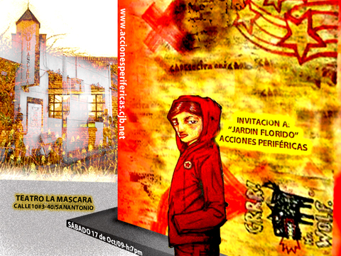

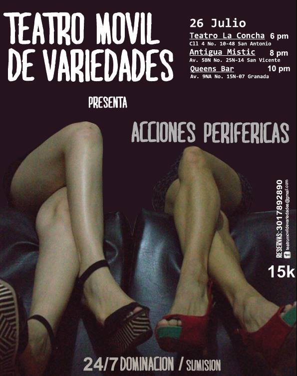

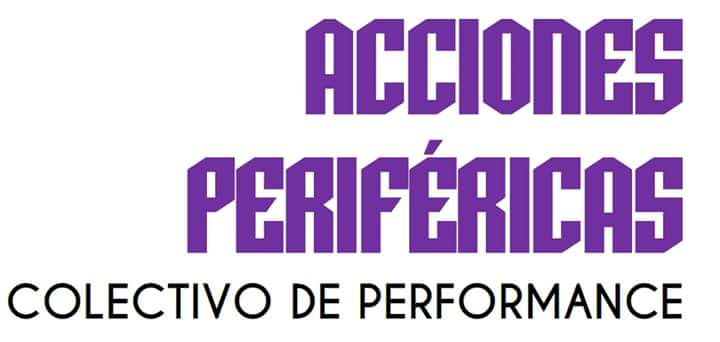

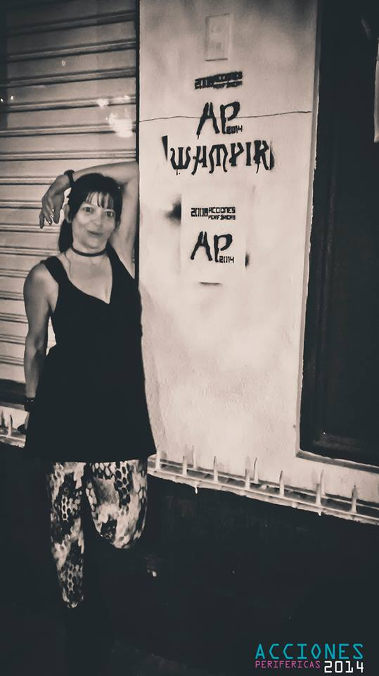

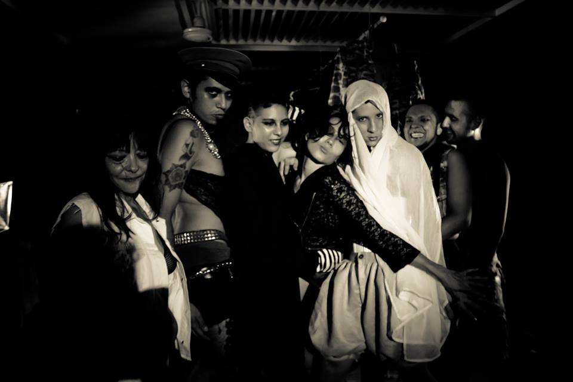

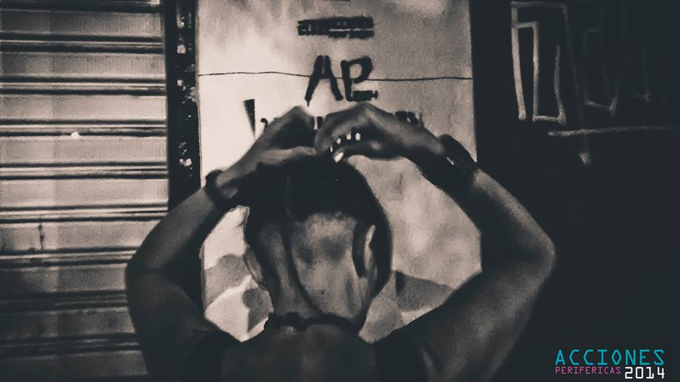

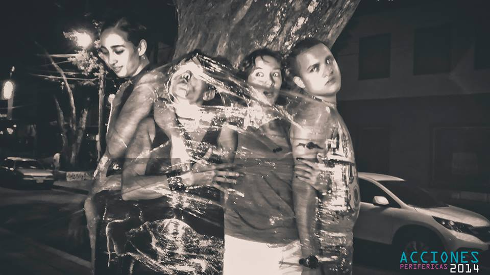

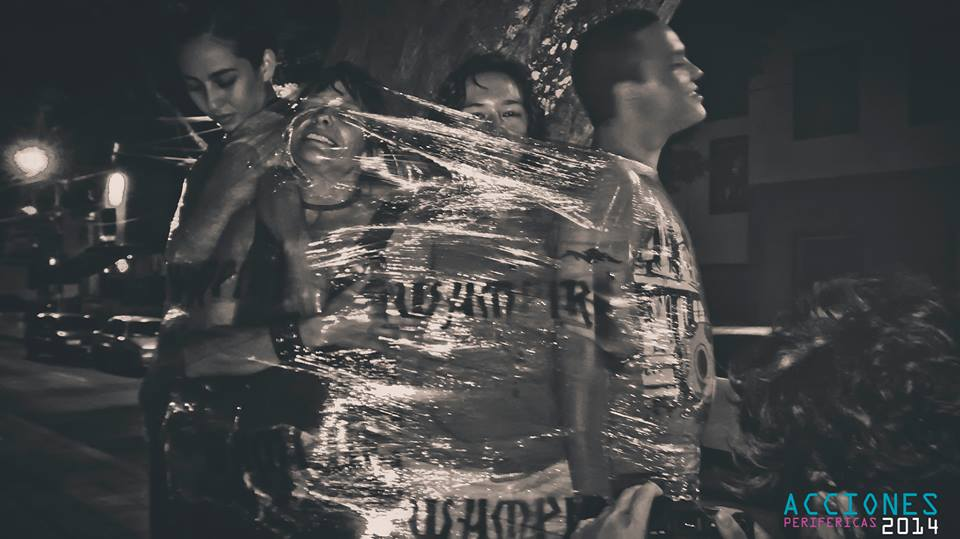

### Mientras dormimos:
Intervencion realizada durante el festival de musica alternativa Cali Underground. El colectivo se instaló a la manera de flash mob con una acción de exorcismo a las distintas formas de violencia en el el espacio urbano y en el imaginario colectivos de los performers participantes, mediante una guerra de almohadas a ritmo de percusion, con la consigna "hiede a muerte".

### Tierra:
Obra de Land art realizado en el día de la tierra, 22 de marzo, en La Loma de la Cruz. Con una gran espiral se hizo un ritual a la tierra en la que se sembraron semillas y se invitó a los transeúntes a llevar a casa parte de la ofrenda en vasos desechables reciclados de restaurantes; con la idea que en un plazo de dos meses en los jardines de los participantes brotaran girasoles, pensamientos, canabis, coca y otras plantas ornamentales y medicinales.

### Jardín Florido. Intervención en el Teatro La Máscara. 2008.
La performer indaga en el rito de pasaje hacia la adultez, rompiendo el cordón umbilical que le ata a su madre y a una estructura social establecida por la ley del padre.
<https://accionesperifericas.wordpress.com/2009/10/06/canovacho-jardin-florido-1/>

<iframe width="854" height="510" src="https://www.youtube.com/embed/qj0d4XibhgY" frameborder="0" allowfullscreen></iframe>

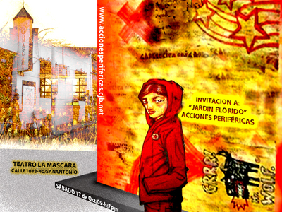

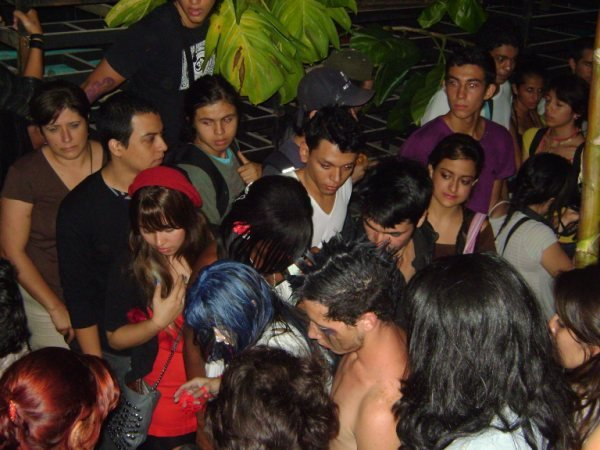

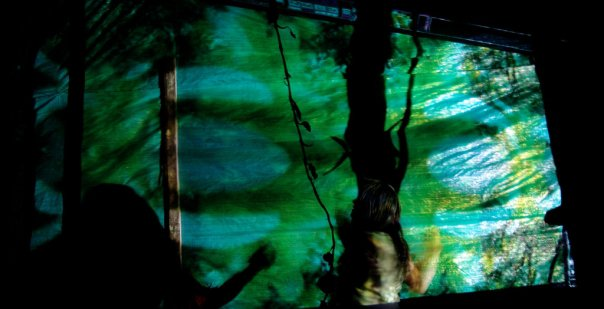

### Bosque de imágenes:
Es el preámbulo de lo que es una vida inmersa en el mundo del arte, de la imágen y del ruido, espejandose  en las opciones musicales y los estilos de vida de las culturas suburbanas

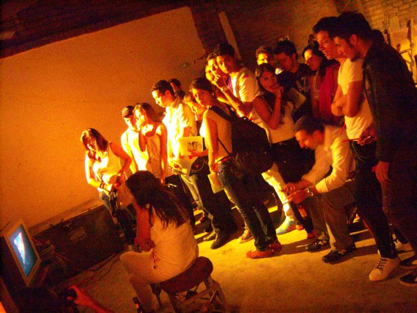

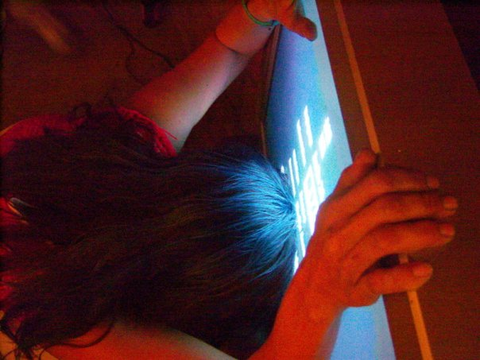

### Intimisex:
Es un compendio de tres acciones colectivas que se realizan dentro del *Festival desgenerate* que realizo Mundo Diverso, coordinado por Lina Durán, donde se ponen en juego la acción política del vestir mediante el travestismo, la libertad sexual y las diversas posibilidades políticas de ser y estar en el mundo como ciudadanos en tránsito, cuestionando la imposición de género.

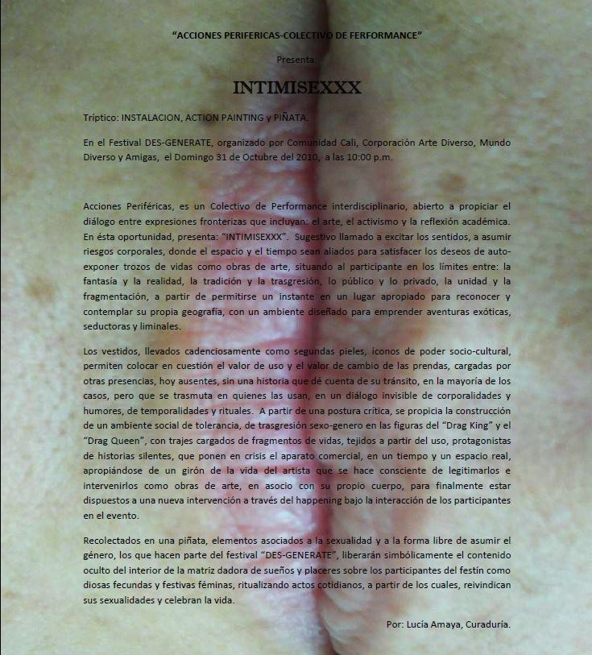

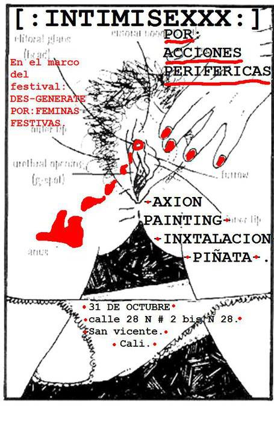

### Cali:
 Acciones centradas en el cuerpo, el espacio y las formas de ejercer ciudadanía, para lo cual se realizan unos recorridos urbanos que guardan estrecha relación con las propias vivencias e inquietudes personales de los performers cercanas a sus formas de vivir e imaginar la ciudad.
Durante un espacio de 24 horas un grupo de performers investiga sobre las diferentes formas de habitar la ciudad de Cali, desde lo físico, lo sonoro y lo sensorial, para develar las múltiples posibilidades presentes en el diario vivir del caleño: habitos,  cotidianidades, caos, marginalidad y desigualdad se hacen presentes. El encuentro y yuxtaposición de la exploración en formatos diversos se realizó en las instalaciones de Bellas Artes.

## Mural efímero:
Con la necesidad de seguir produciendo acciones con un fuerte contenido político y social, centro la atención sobre la mujer y las diferentes formas en que sus derechos son violados, buscando evidenciar la violencia de género y hacer consciencia de trabajar hacia la libertad, denunciando omisiones, segregaciones, abusos y maltratos. se hizo intervenciones en las zonas centricas de cali en febrero y en marzo 8 del 2015 una gran accion con el publico de la marcha por el dia de la mujer.

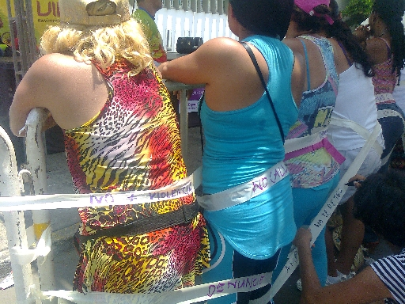

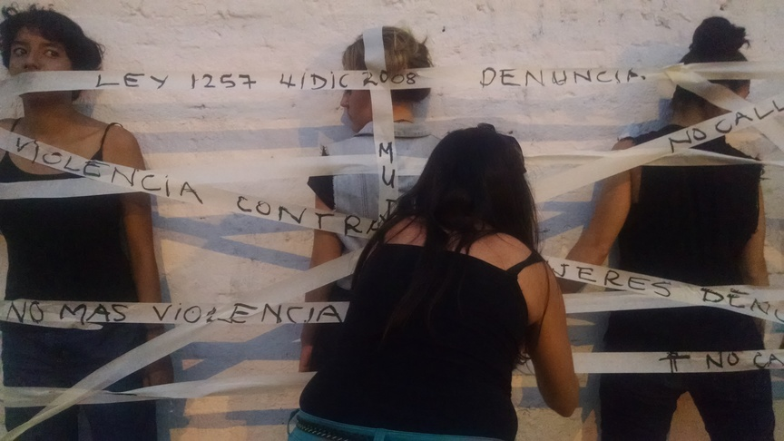

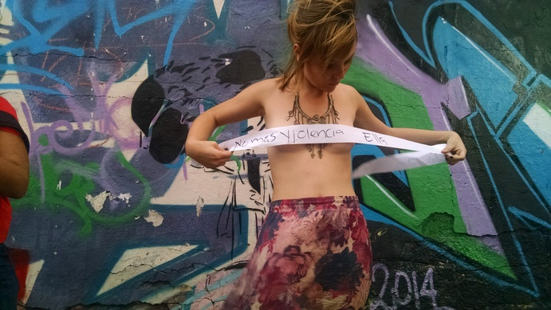

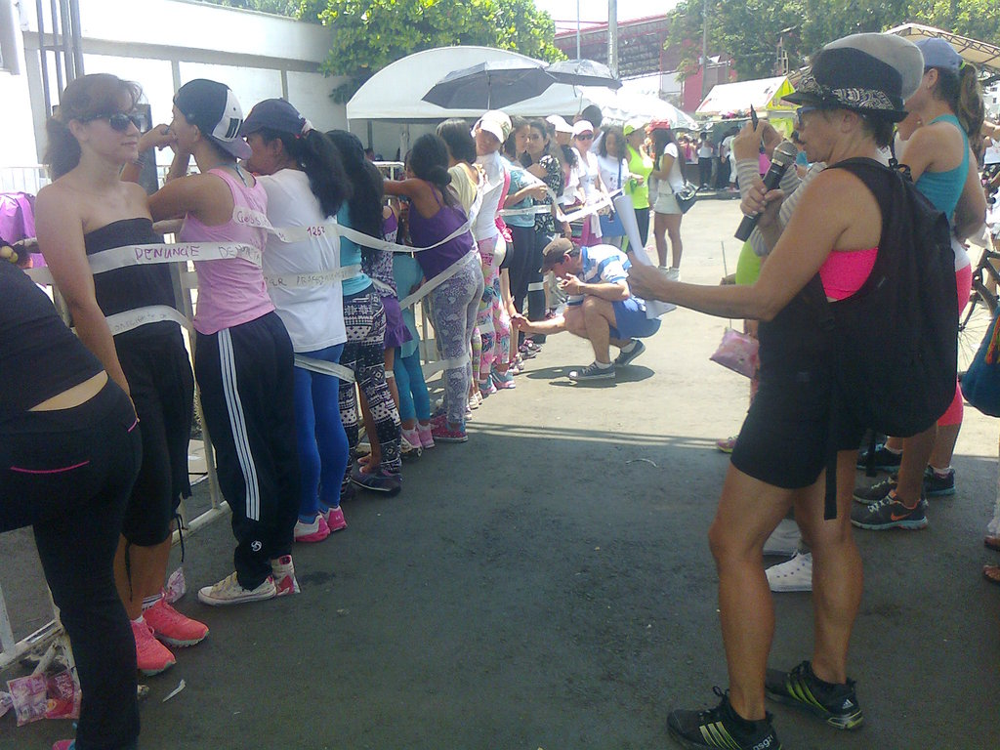

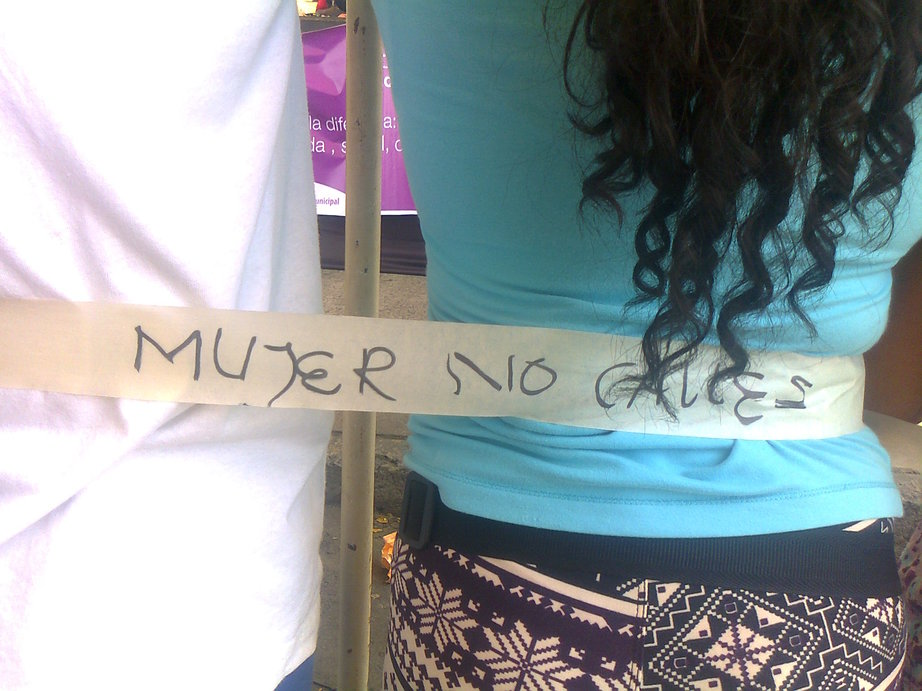

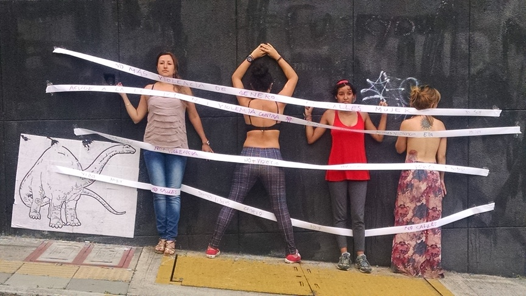

## Escrito en el cuerpo:
Investigación con base en las decisiones que cada individuo toma  para modificarlo o marcar su cuerpo.
Obra presentada en la intervención colectiva "entrepiernas" orientada hacia el cuerpo y el género, 2015.

## Performance Art y Diversidad.
Colectivo de performance constituido en febrero del 2015 en Cali, investiga el arte de acción y la acción política en el ejercicio de la ciudadanía.

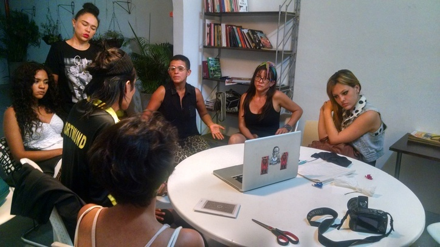

### “Salta, el piso aparecerá”:
Performance realizado en la exposición: Cuerpos, encuentro sobre diversidad de género, Museo de Arte religioso, étnico y cultural, 15 de Julio del 2015.

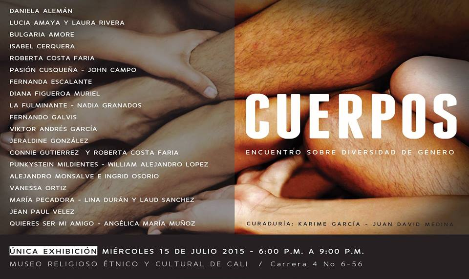
